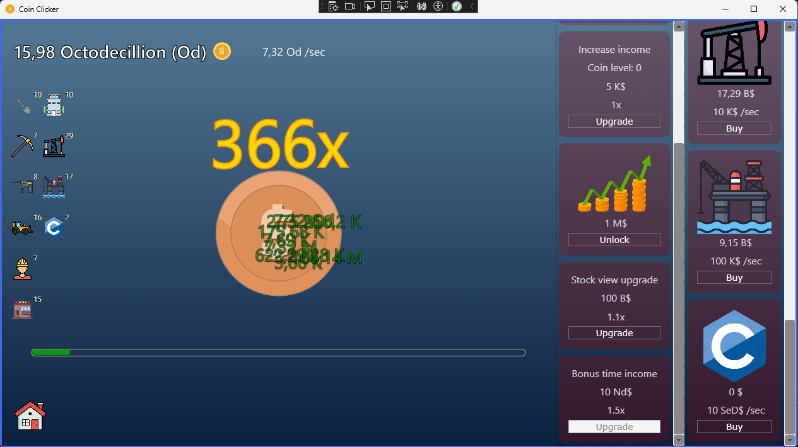
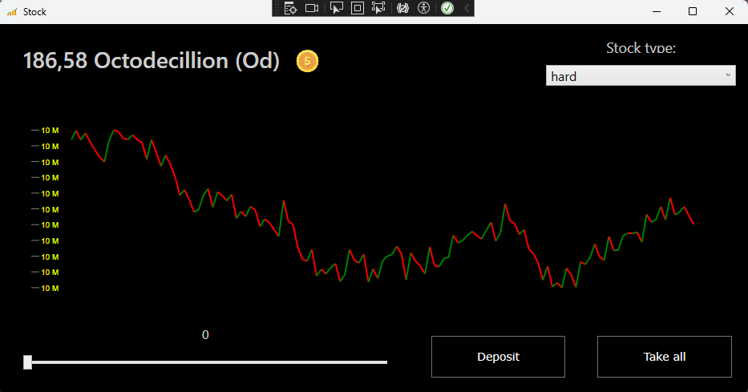

# Description
This game is a clicker game, which I have been created in C# WPF.

The game is very unbalanced and contains a temporarly upgrade for debug puprose.

# Download

# Features
- Auto clicker upgrades
- Auto saving system in json
- Easy to MOD the game, throught save files
- Stock simulation system, for deposit money in different stocks

# How to MOD the game
there are a few save fils in the Resources/Save folder.

- In player.json we can modify the player's properties
- In stock.jon we can modify and add new stocks into the game.
- In upgrade.json we can also modify and add new upgrades into the game.
- In tutorial.json we can create own tutorials if its needed for the MOD's.

# Add custom music
In Resources/Music folder where you can add custom music, with mp3 format.
